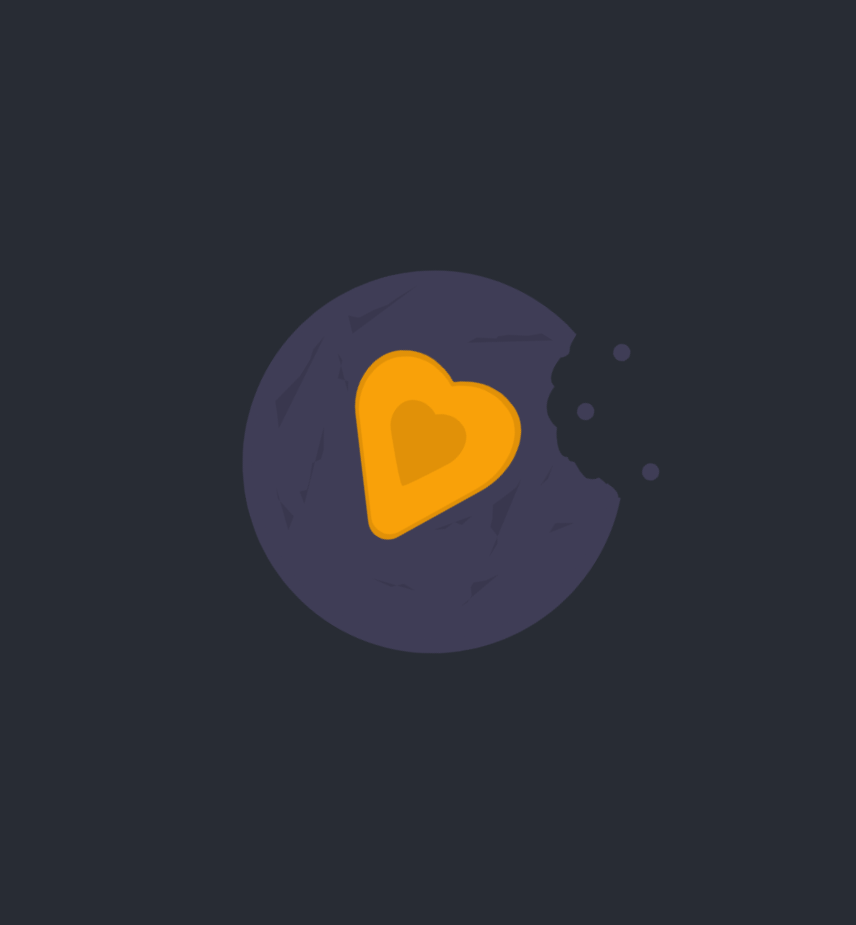

<h1 align="center">Shoppingifty</h1>

<div align="center">
   Solution for a challenge from  <a href="http://devchallenges.io" target="_blank">Devchallenges.io</a>.
</div>

<div align="center">
  <h3>
    <a href="https://{your-demo-link.your-domain}">
      Demo
    </a>
    <span> | </span>
    <a href="https://github.com/DLatouche/shoppingnify-chall">
      Solution
    </a>
    <span> | </span>
    <a href="https://devchallenges.io/challenges/mGd5VpbO4JnzU6I9l96x">
      Challenge
    </a>
  </h3>
</div>

## Table of Contents

- [Overview](#overview)
  - [Built With](#built-with)
- [Features](#features)
- [How to use](#how-to-use)
- [Contact](#contact)

## Overview



### Built With

- [React](https://reactjs.org/)
- [Redux](https://redux.js.org/)
- [Scss](https://sass-lang.com/)

## Features

This application/site was created as a submission to a [DevChallenges](https://devchallenges.io/challenges) challenge. The [challenge](https://devchallenges.io/challenges/mGd5VpbO4JnzU6I9l96x) was to build an application to complete the given user stories.

## How To Use


To clone and run this application, you'll need [Git](https://git-scm.com) and [Node.js](https://nodejs.org/en/download/) (which comes with [npm](http://npmjs.com)) installed on your computer. From your command line:

```bash
# Clone this repository
$ git clone https://github.com/DLatouche/shoppingnify-chall.git

# Install dependencies
$ npm install

# Run the app
$ npm start
```

## Contact

- GitHub [@DLatouche](https://github.com/DLatouche)
- You can contacte me to dorian.latouche@hotmail.com
